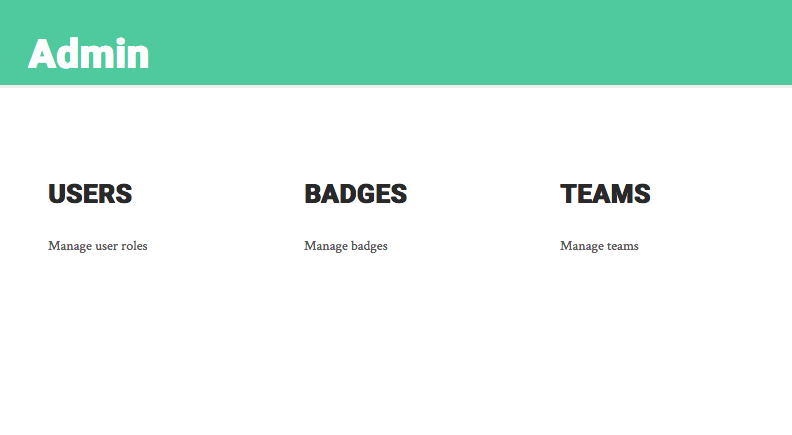

To view the current badges available to Scoreboard, click on “Manage badges” from the Admin page

You will see the list of badges currently available to be earned on the right side, and a link to Create a New Badge on the left.

When you select “Create New Badge”, you will be taken to an empty form with fields for the name and description for the badge, along with a section containing the requirements for earning that badge. 

If you select “Add another condition”, you will see the form expand to accommodate another requirement. You can add as many conditions as you like, and they can be of differing types; just remember that, due to the current constraints of the input data, each requirement is evaluated independently. 

Thus, a requirement to use a certain hashtag combined with a requirement to map a certain number of buildings will evaluate just that; it will *not* evaluate whether a user mapped that number of buildings *while using* that hashtag. This feature can be implemented later on if it is of interest.

Once you have selected all of your operations, you will see all of the available badge images. Select the image which will be shown as the badge you have created.

To select an image, simply navigate to it by clicking the image, the thumbnail associated with that image, or the white dot corresponding to that image’s location in the list.

Click "Create badge" to complete the badge creation process, at which point you should see a pop-up reading "Badge created successfully!" Your badge should now be listed alongside the other badges on your admin panel, and will appear immediately in all eligible users' In-Progress and Earned Badge panels.
