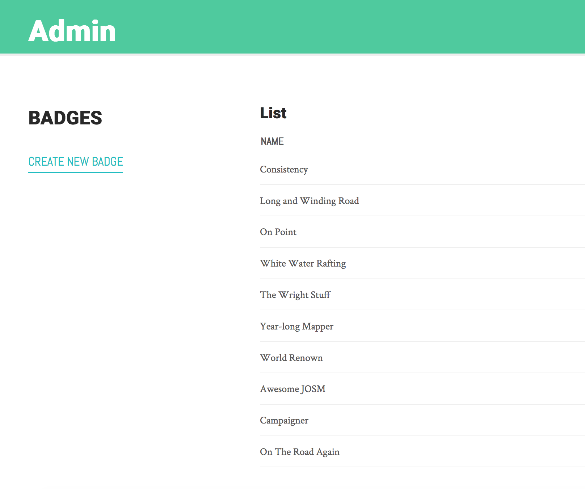
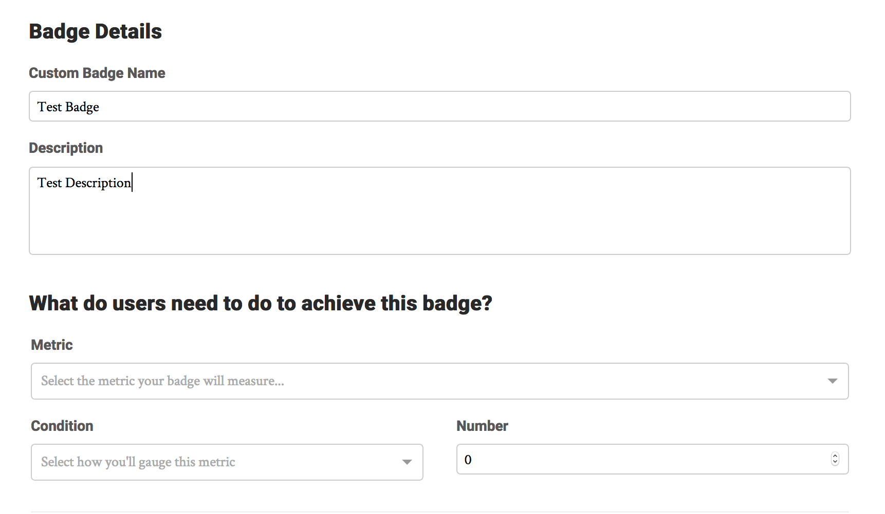
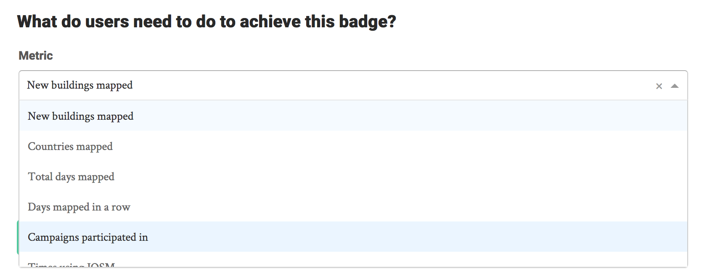
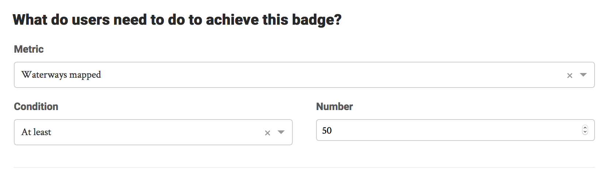
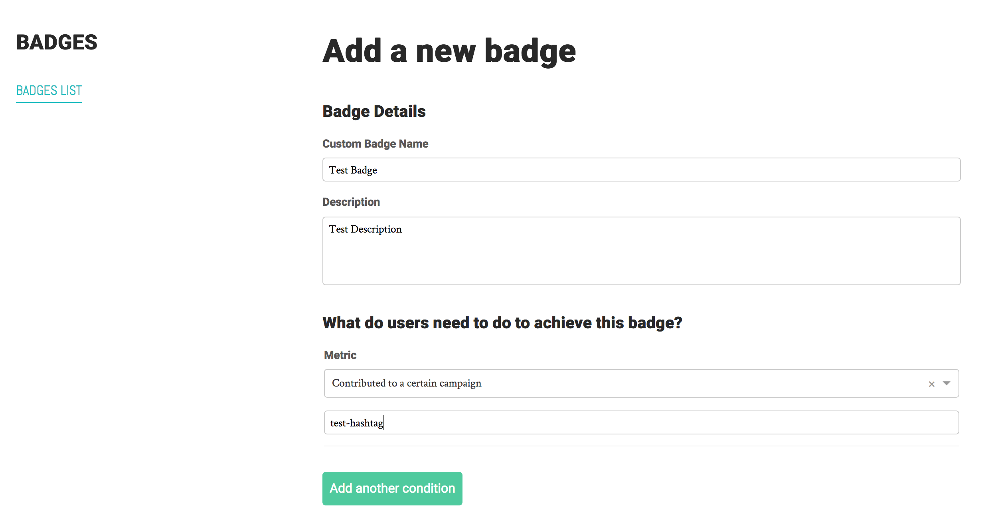
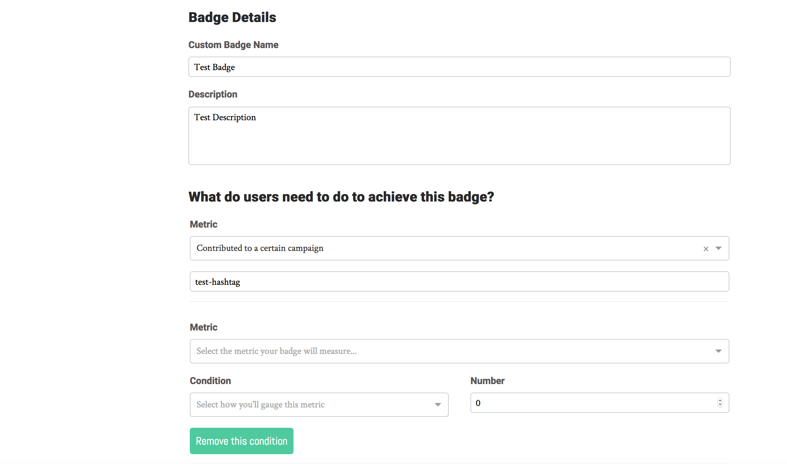
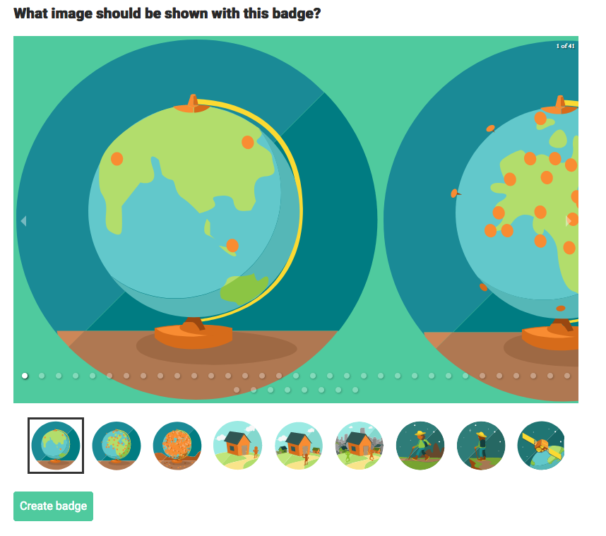
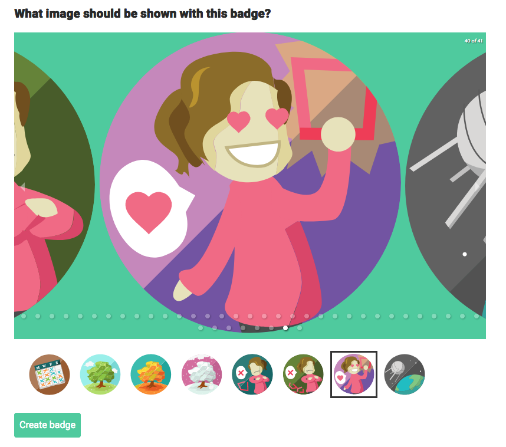

Click the link to Create a New Badge on the left-hand side of the Admin Badge Panel.

When you select “Create New Badge”, you will be taken to an empty form with fields for the name and description for the badge, along with a section containing the conditions for earning that badge. 

 

## Setting the conditions for earning a badge

The first part of every type of condition is the metric to measure against when determining whether someone has earned this badge. Click the arrow to see a dropdown containing all of the available metrics.

 For example, select "Waterways Mapped". You can see that the second part of the requirement consists of a condition, and a number.

 

In the above example, the selections translate to "Give this badge to every user who has mapped at least 50 waterways." Now, select "Contributed to a certain campaign" as the metric. You'll see that the second part of the requirement section is now a simple text box, in which you can enter the hashtag you would like a user to use in order to earn this badge.

_Note_: Badges based on a certain hashtag will not appear in a user's "In progress" panel. Hashtags associated with a campaign may fall out of use, and they shouldn't thus clutter a user's In Progress Badge panel. Badges based on a certain hashtag can also be used to assign team-specific badges, and it is preferable for those badges to not appear unless a user has mapped as a part of that team.

If you select “Add another condition”, you will see the form expand to accommodate another requirement.

You can add as many conditions as you like, and they can be of differing types; just remember that, due to the current constraints of the input data, each requirement is evaluated independently. 

Thus, a requirement to use a certain hashtag combined with a requirement to map a certain number of buildings will evaluate just that; it will *not* evaluate whether a user mapped that number of buildings *while using* that hashtag. This feature can be implemented later on if it is of interest.

## Setting the badge image

Once you have selected all of your operations, you will see all of the available badge images. To select the image to be used for your badge, simply navigate to it by clicking the image, the thumbnail associated with that image, or the white dot corresponding to that image’s location in the list.

## Complete your badge!

Click "Create badge" to complete the badge creation process, at which point you should see a pop-up reading "Badge created successfully!" Your badge will be listed alongside the other badges on your admin panel, and will appear immediately in all eligible users' In-Progress and Earned Badge panels.
