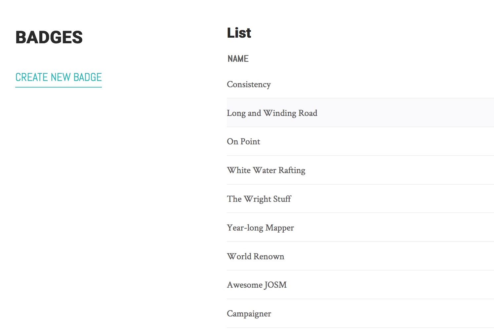
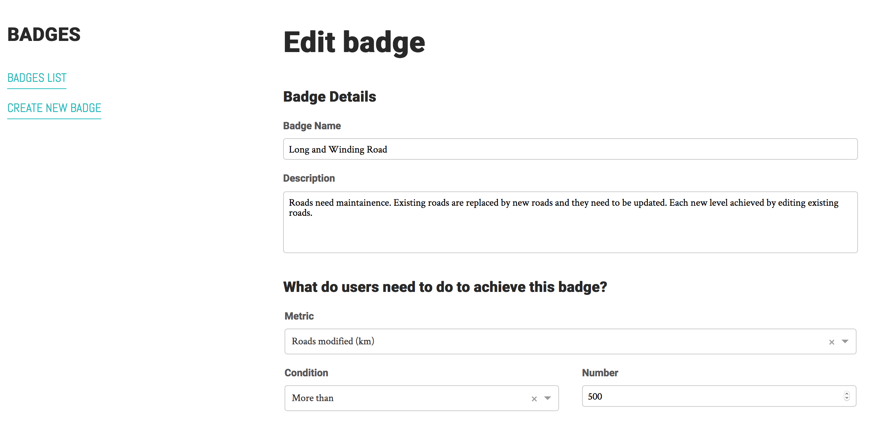

In the Admin Badge panel, you should see a list of currently available badges.

Click on the name of a badge to see and edit the badge details.

All the badge details are editable in the same way they would be if you were [creating a badge](create-badge.md).

